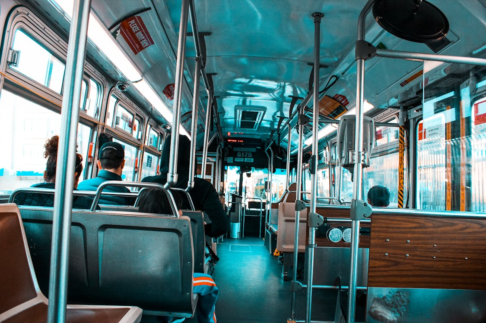

>Observation is more important than manual practice.
&mdash; No one

Well, I can say that for me, it is. After starting studying Computer Science, I wasn't really practicing drawing much. I didn't have enough time to complete complex pieces and most of the times, I was finishing an artwork once in a month or so.

But, strangely enough, those were the years that I saw the most significant improvements in my art. Even though I have stopped actively practicing drawing, I continued observing little details on objects and people in my everyday life.

For instance, let's say you are commuting to and from university classes. Unfortunately the attendance starts early in the morning and finishes around late afternoon when the sun starts to set. While being bored at the bus, if you are not the person to scroll endlessly on your phone or read a book, you can observe how the lighting interacts with the different materials around you (clothes of the passengers, metallic surfaces, etc) and how the overall color palette of the scenery changes. It may be rude sometimes to stare at people, so try to be discreet! 👀 You can also follow the same practice when you go for a walk. 

*Figure 3: [Material reflections](https://www.pexels.com/photo/bus-bench-seats-808846/)*

Because our memory is kind of hazy, especially when we are burnout, someone can still take pictures of objects and sceneries they may find particularly eye-catching which they can lately use as a reference to create something meaningful.

Observing has to be something you do constantly, and when you are idle, you can put the process of it in the foreground. Think of it as some form of [*Deliberate practice*](https://graphics8.nytimes.com/images/blogs/freakonomics/pdf/DeliberatePractice(PsychologicalReview).pdf).

According to many non-scientific claims or scarcity of sources, it is said that visual perception fully develops at your initial adult years. What is true though, is that *observing* requires a percentage of your mental capacity, your occipital lobe is definitely working overtime...

But if people grow up observing, even at a more passive rate, they have a better chance at translating the details they have absorbed over the years into paper. I can assume that if you give a task to draw a house or a potrait to a teenager and an adult, there is a higher chance that the adult makes a more realistic representation than the teenager, given no prior training (Give it a try!). The adult has had more years in their life to observe their surroundings. 

